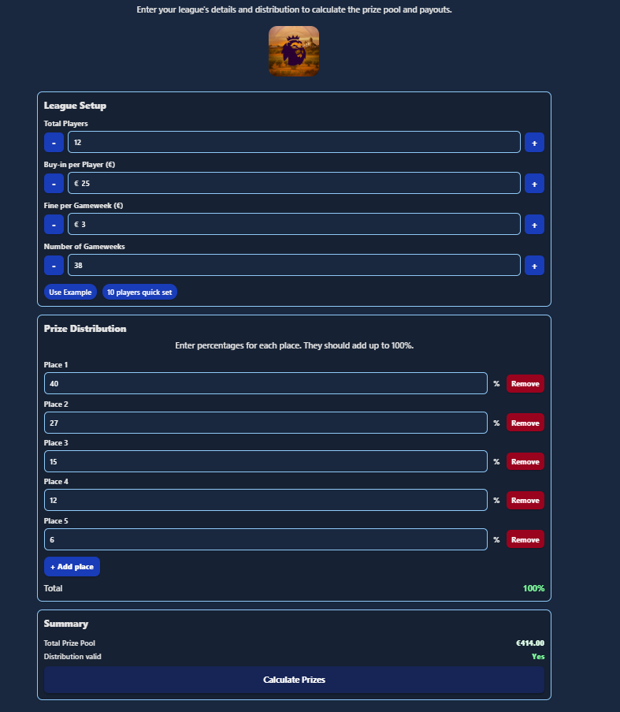
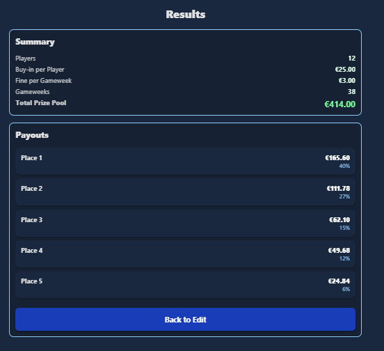

# ⚽ Fantasy League Prize Calculator

A web app that helps **fantasy football league organizers** calculate prize payouts based on league setup, buy-ins, fines, and chosen distribution percentages.  
Built with modern web technologies and designed for clarity and ease of use.

🔗 **Live Demo:** [fantasy-league-prize-calculator.vercel.app](https://fantasy-league-prize-calculator.vercel.app/)  
📦 **Repository:** [GitHub Repo](https://github.com/PortuguesRicardo/Fantasy-League-Prize-Calculator)

---

## 📸 Preview

### League Setup & Prize Distribution
Configure players, buy-ins, fines, and number of gameweeks.

Distribute the prize pool by percentages across different places.



### Results
Get instant payout results based on your configuration.



---

##  Features
-  **Flexible League Setup** – configure players, buy-ins, fines, and gameweeks.  
-  **Custom Prize Distribution** – assign percentages to any number of places.  
-  **Instant Calculation** – automatically generates payouts.  
-  **Responsive Design** – works seamlessly across desktop and mobile.  
-  **Modern UI** – clean, minimal design for usability.  

---

## 🛠️ Tech Stack
- **React**   
- **TypeScript**  
- **Expo / React Native Web**  
- **React Navigation**   
- **Tailwind CSS** 
- **Vercel** 

---

## Getting Started

### Clone the repository

```bash
git clone https://github.com/PortuguesRicardo/Fantasy-League-Prize-Calculator.git
cd Fantasy-League-Prize-Calculator
```
## Install dependencies
```
npm install
```
## Run locally

```
npm start
```

## Build

```
npm run build
```
## Run on Expo

```
npx expo start
```

### Project Purpose

This project was created to simplify the process of managing fantasy league payouts.
Instead of spreadsheets or manual math, the app ensures fair and quick prize distribution for organizers and participants.

## License

This project is open source under the MIT License

## 🤝 Contributing

Contributions are welcome! Fork the repo and submit a pull request.
